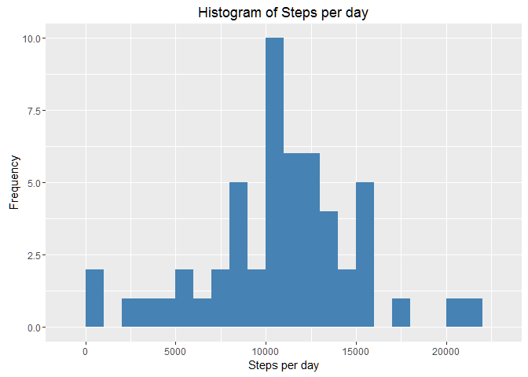
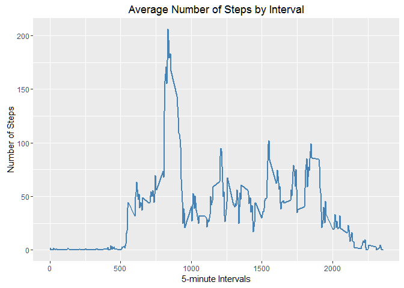
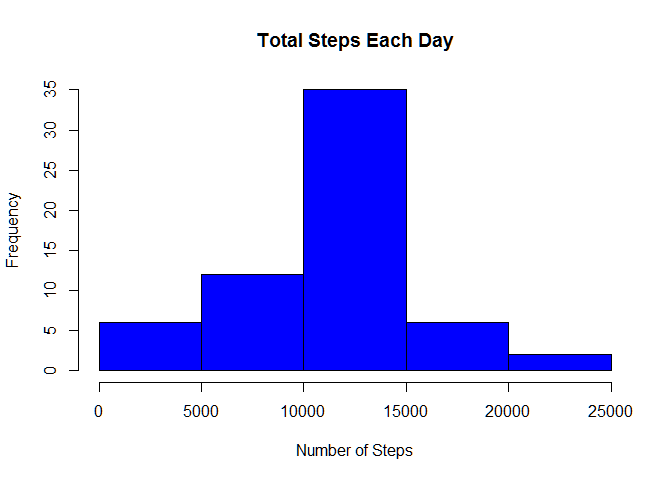
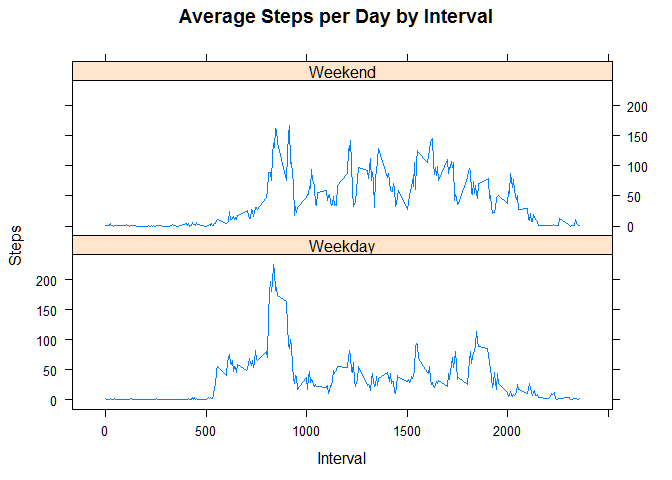

# Reproducible Research: Peer Assessment 1
Filippo Mingione  
April 3, 2016  


## Intoduction
This assignment makes use of data from a personal activity monitoring device. This device collects data at 5 minute intervals through out the day. The data consists of two months of data from an anonymous individual collected during the months of October and November, 2012 and include the number of steps taken in 5 minute intervals each day.

This document presents the results from Project Assignment 1 in the Coursera course Reproducible Research, written in a single R markdown document that can be processed by knitr and transformed into an HTML file.

## Preparing R and Loading necessary packages

```r
library(knitr)
opts_chunk$set(echo = TRUE) #setting echo = true so that reviewers can see the code
opts_chunk$set(warning = FALSE) # setting warning = false to declutter html
library(dplyr)
```

```
## 
## Attaching package: 'dplyr'
```

```
## The following objects are masked from 'package:stats':
## 
##     filter, lag
```

```
## The following objects are masked from 'package:base':
## 
##     intersect, setdiff, setequal, union
```

```r
library(lubridate)
library(ggplot2)
```

## Loading and preprocessing the data
Download, unzip and load data into data frame ```data```.

```r
if(!file.exists("repdata-data-activity.zip")) {
        temp <- tempfile()
        download.file("https://d396qusza40orc.cloudfront.net/repdata%2Fdata%2Factivity.zip",temp)
        unzip(temp)
        unlink(temp)
}

activity <- read.csv("activity.csv", colClasses = c("numeric", "character", "integer"))
```

Change the date into dateformat using ```lubridate```:

```r
activity$date <- ymd(activity$date)
```

## What is mean total number of steps taken per day?
For this part of the assignment the missing values can be ignored.

1. Calculate the total number of steps taken per day

```r
steps_by_day <- aggregate(activity$steps ~ activity$date, FUN=sum )
colnames(steps_by_day)<- c("Date", "Steps")
```

2. Make a histogram of the total number of steps taken each day

```r
ggplot(steps_by_day, aes(x = Steps)) +
  geom_histogram(fill = "steelblue", binwidth = 1000) +
  labs(title = "Histogram of Steps per day", x = "Steps per day", y = "Frequency")
```



3. Calculate and report the mean and median of the total number of steps taken per day

```r
mean_steps <- mean(steps_by_day$Steps)
median_steps <- median(steps_by_day$Steps)
```

Mean total number of steps taken per day:

```r
mean_steps
```

```
## [1] 10766.19
```

Median total number of steps taken per day:

```r
median_steps
```

```
## [1] 10765
```

## What is the average daily activity pattern?
1. Make a time series plot (i.e. type = "l") of the 5-minute interval (x-axis) and the average number of steps taken, averaged across all days (y-axis)


```r
steps_by_interval <- aggregate(steps ~ interval, activity, mean)
ggplot(steps_by_interval, aes(interval, steps), type="l") + geom_line(color = "steelblue", size = 0.8) + labs(title = "Average Number of Steps by Interval", x = "5-minute Intervals", y = "Number of Steps")
```



2. Which 5-minute interval, on average across all the days in the dataset, contains the maximum number of steps?


```r
max_interval <- steps_by_interval[which.max(steps_by_interval$steps),1]
```

The 5-minute interval which contains the maximum number of steps is:

```r
max_interval
```

```
## [1] 835
```

## Imputing missing values

1. Calculate and report the total number of missing values in the dataset (i.e. the total number of rows with NAs)

```r
sum(is.na(activity))
```

```
## [1] 2304
```

2. Devise a strategy for filling in all of the missing values in the dataset. The strategy does not need to be sophisticated. For example, you could use the mean/median for that day, or the mean for that 5-minute interval, etc

Missing values were imputed by inserting the average for each interval. Thus, if an interval was missing on a specific day, the average for that interval for all days replaced the NA.

3. Create a new dataset that is equal to the original dataset but with the missing data filled in


```r
incomplete <- sum(!complete.cases(activity))
imputed_data <- transform(activity, steps = ifelse(is.na(activity$steps), steps_by_interval$steps[match(activity$interval, steps_by_interval$interval)], activity$steps))
```

Zeroes were imputed for the first day of the dataset.


```r
imputed_data[as.character(imputed_data$date) == "2012-10-01", 1] <- 0
```

4. Make a histogram of the total number of steps taken each day and Calculate and report the mean and median total number of steps taken per day. Do these values differ from the estimates from the first part of the assignment? What is the impact of imputing missing data on the estimates of the total daily number of steps?


```r
steps_by_day_i <- aggregate(steps ~ date, imputed_data, sum)


#Create Histogram to show difference. 
steps_by_day_i <- aggregate(steps ~ date, imputed_data, sum)
hist(steps_by_day_i$steps, main = paste("Total Steps Each Day"), col="blue", xlab="Number of Steps")
```



Calculate new mean and median for imputed data


```r
rmean.i <- mean(steps_by_day_i$steps)
rmedian.i <- median(steps_by_day_i$steps)
```

Calculate total difference.

```r
total_diff <- sum(steps_by_day_i$steps) - sum(steps_by_day$steps)
```

## Are there differences in activity patterns between weekdays and weekends?
Created a plot to compare and contrast number of steps between the week and weekend. There is a higher peak earlier on weekdays, and more overall activity on weekends.


```r
weekdays <- c("Monday", "Tuesday", "Wednesday", "Thursday", 
              "Friday")
imputed_data$dow = as.factor(ifelse(is.element(weekdays(as.Date(imputed_data$date)),weekdays), "Weekday", "Weekend"))

steps_by_interval_i <- aggregate(steps ~ interval + dow, imputed_data, mean)

library(lattice)

xyplot(steps_by_interval_i$steps ~ steps_by_interval_i$interval|steps_by_interval_i$dow, main="Average Steps per Day by Interval",xlab="Interval", ylab="Steps",layout=c(1,2), type="l")
```



